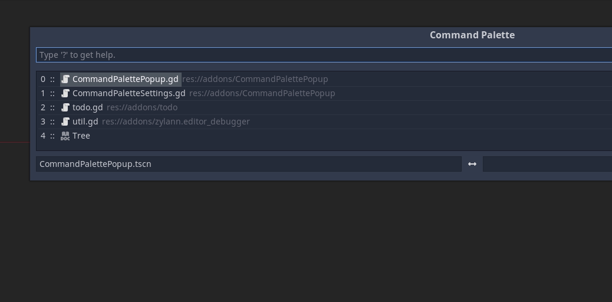
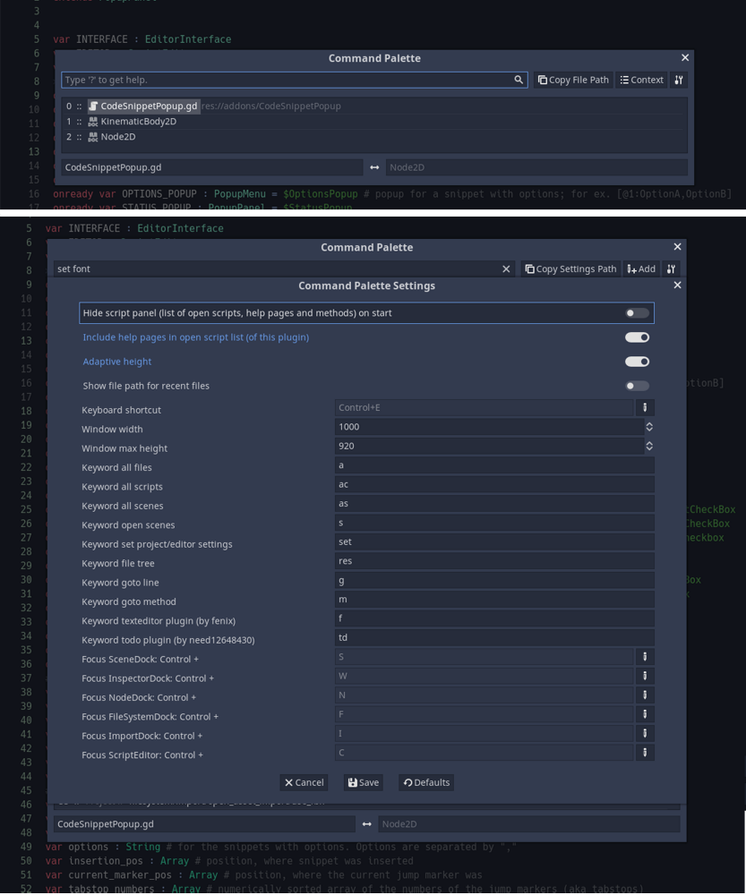

# A Command Palette for Godot

**See the built-in help page (type "?") on how to use the features.**

**Features. Use your keyboad to**:

- Open any file. Filter by type or name. 
- Focus Godot's dock with keyboard shortcuts.
- Edit general Project/Editor settings. Add new Project settings (kinda barebones atm).
- Traverse the file tree with autocompletion on paths (list all files and folders in a given path; see preview.gif).
- Use the context menu for the FileSystemDock and script panel. -- experimental. Basically... I just simulate a right click at a specific position.
- Go to line.
- Go to method.
- Quickly switch to the last file opened.
- access of https://github.com/fenix-hub/godot-engine.text-editor and https://github.com/need12648430/godot3-todo via command palette. **I have no affiliation with any of those plugins. I only use them personally.**

*Minor stuff*:

- A copy button is available to the right of the search LineEdit. This way you can quickly copy the file and settings paths.
- Opening a script also opens the scene, which the script is attached to. This gives you autocompletion on the Node(Paths) and their methods.
- Ending the search_string with "  " (double space) will autocomplete file and settings path.

**Installation**:

Either download it from the official Godot AssetLib (within Godot itself) or download the addons folder from here and move it to the root (res://) of your project. Enable the plugin in the project settings.

**Usage**:

* Install via instructions above
* On Windows / Linux press "Ctrl+E" to open it, on Mac press "Cmd+P"

**Preview**

**Changelog for 1.6.0**:

- removed ability to focus inspector properties and SceneTree options. Instead added shortcuts to focus Godot's built-in docks with the keyboard.
- updated readme/help pages and preview images accordingly
- bugfix: wrong sorting of ItemList and other minor stuff

**Changelog for 1.5.1**:

- changed default shortcut to Control+E (for easier one-handed activation)
- expanded and streamlined the settings page 
